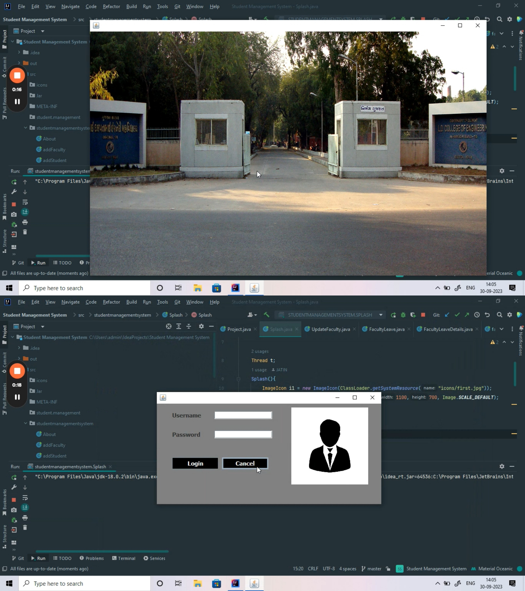
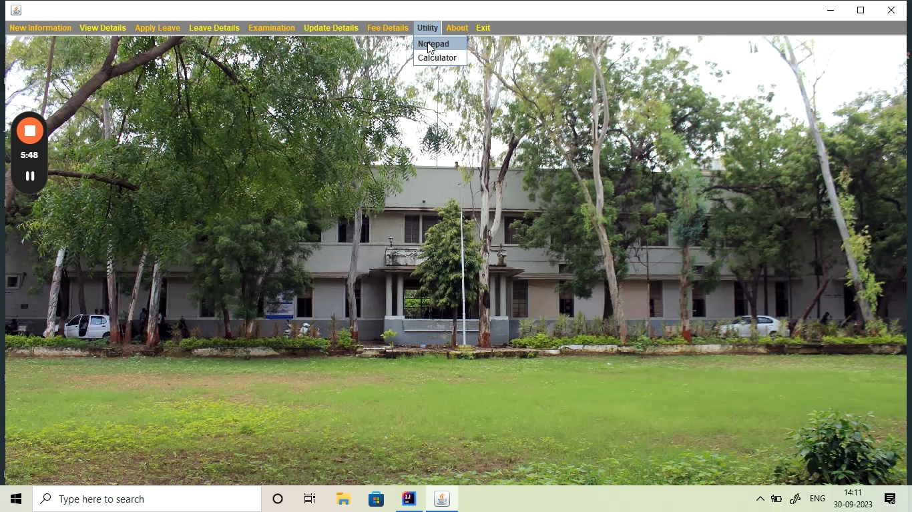
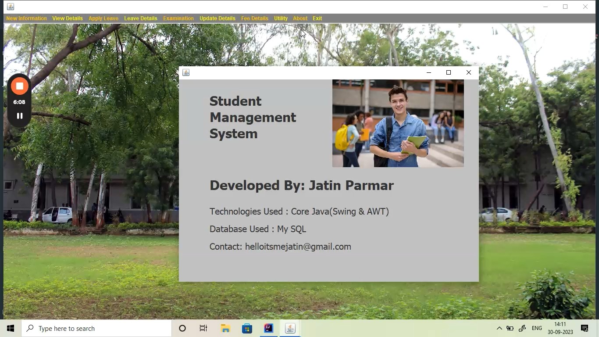

# Student Management System

A comprehensive Student Management System designed to streamline administrative tasks for educational institutions. Explore the key features and screenshots below.

## Features

- **Login Screen:** Secure login for administrators and students.
- **Student Details Form:** Easily manage and update student information.
- **Apply for Leave:** Students can request leave online, and administrators can approve or reject requests.
- **Check Student Details:** View detailed information about students.
- **Check Leave Details:** Track leave records for students.
- **Enter Marks:** Input and manage student examination scores.
- **See Result:** Generate and view student results.
- **Check Fees Structure:** Access information about fees and payment schedules.
- **Pay Fees:** Convenient online fee payment functionality.
- **Utilities (Notepad & Calculator):** Additional tools for convenience.
- **About Page:** Learn more about the Student Management System.

## Screenshots

Here are some screenshots from the Student Management System:

### Login Screen

### Student Details Form

### Apply for Leave

### Check Student Details

### Check Leave Details

### Enter Marks

### See Result

### Check Fees Structure

### Pay Fees

### Utilities (Notepad & Calculator)

### About Page

